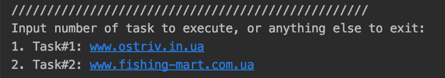
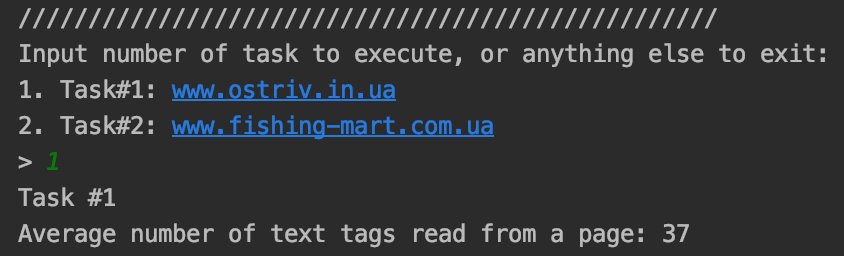
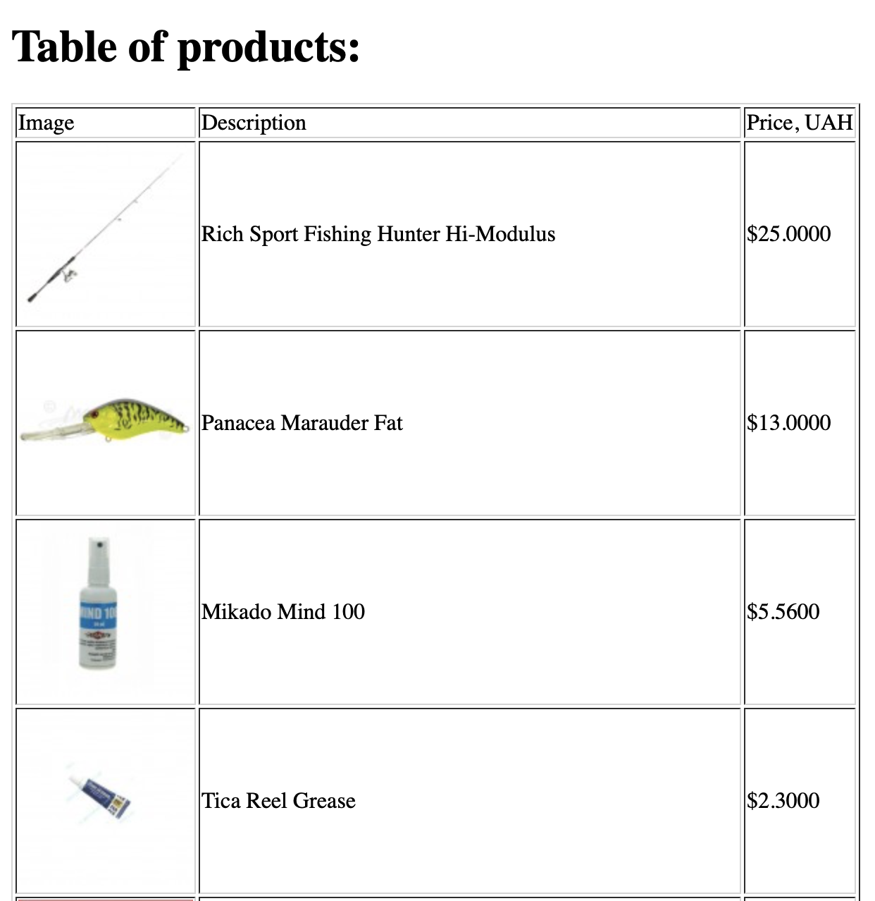

# Лабораторна робота No 1. Вивчення базових операцій обробки XML-документів

## Варіант завдання

2 варіант згідно номера у списку групи

Через проблеми із зчитуванням даних із сайтів, вказаних у варіанті, було використано посилання із 20 варіанту, який
ніхто не виконував. Зміст завдання 2 залишився із 2 варіанту.

| Базова сторінка (завдання 1) | Зміст завдання 2     | Адреса інтернет-магазину (завдання 3) |
|------------------------------|----------------------|---------------------------------------|
| www.ostriv.in.ua         | Середня кількість текстових фрагментів | www.fishing-mart.com.ua |

## Лістинг коду

### Збирання даних зі сторінки www.ostriv.in.ua   

`spiders/ostriv.py`

```python
class OstrivSpider(scrapy.Spider):
    name = 'ostriv'
    allowed_domains = ['tsikave.ostriv.in.ua']
    start_urls = ['http://tsikave.ostriv.in.ua/']

    def parse(self, response: Response):
        all_images = response.xpath("//article/a/img/@src")
        all_text = response.xpath("//*[not(self::script)][not(self::style)][string-length(normalize-space(text())) > 30]/text()")
        yield {
            'url': response.url,
            'payload': [{'type': 'text', 'data': text.get().strip()} for text in all_text] +
                       [{'type': 'image', 'data': 'http://tsikave.ostriv.in.ua' + image.get()[22:len(image.get())-2]} for image in all_images]
        }
        if response.url == self.start_urls[0]:
            all_links = response.xpath(
                "//a/@href[starts-with(., '/list/')]")
            selected_links = ['http://tsikave.ostriv.in.ua' + link.get() for link in all_links][:19]
            for link in selected_links:
                yield scrapy.Request(link, self.parse)

```

### Збирання даних зі сторінки www.fishing-mart.com.ua

`spiders/fishing.py`

```python
class FishingSpider(scrapy.Spider):
    name = 'fishing'
    allowed_domains = ['fishing-mart.com.ua']
    start_urls = ['http://www.fishing-mart.com.ua/2-fishing-mart-spinningovaya-ribalka?id_category=2&n=60']

    def parse(self, response: Response):
        products = response.xpath("//div[contains(@class, 'product-container')]")[:20]
        for product in products:
            yield {
                'description': product.xpath(".//img[@class='replace-2x img-responsive']/@title").get(),
                'price': product.xpath(".//span[@class='price product-price']/text()").get(),
                'img': product.xpath(".//img[@class='replace-2x img-responsive']/@src").get()
```

### Запис зібраних даних до файлів

`pipelines.py`

```python
class Lab1Sem2Pipeline(object):
    def __init__(self):
        self.root = None

    def open_spider(self, spider):
        self.root = etree.Element("data" if spider.name == "ostriv" else "fishing")

    def close_spider(self, spider):
        with open('task%d.xml' % (1 if spider.name == "ostriv" else 2), 'wb') as f:
            f.write(etree.tostring(self.root, encoding="UTF-8", pretty_print=True, xml_declaration=True))

    def process_item(self, item, spider):
        if spider.name == "ostriv":
            page = etree.Element("page", url=item["url"])
            for payload in item["payload"]:
                fragment = etree.Element("fragment", type=payload["type"])
                fragment.text = payload["data"]
                page.append(fragment)
            self.root.append(page)
        else:
            product = etree.Element("product")
            desc = etree.Element("description")
            desc.text = item["description"]
            pr = etree.Element("price")
            pr.text = item["price"]
            img = etree.Element("image")
            img.text = item["img"]
            product.append(desc)
            product.append(pr)
            product.append(img)
            self.root.append(product)
        return item
```

### Завдання №1

`main.py`

```python
def task1():
    print("Task #1")
    root = etree.parse("task1.xml")
    pages = root.xpath("//fragment[@type='text']")
    print("Average number of text tags read from a page: %s" % ((len(pages))//20))
```

### Завдання №2

`main.py`

```python
def task2():
    print("Task #2")
    transform = etree.XSLT(etree.parse("templateTask2.xsl"))
    result = transform(etree.parse("task2.xml"))
    result.write("task2.xhtml", pretty_print=True, encoding="UTF-8")
    webbrowser.open('file://' + os.path.realpath("task2.xhtml"))
```

`task2.xsl`

```xml
<?xml version="1.0" encoding="UTF-8"?>
<xsl:stylesheet version="1.0" xmlns:xsl="http://www.w3.org/1999/XSL/Transform" xmlns="http://www.w3.org/1999/xhtml">
    <xsl:output
        method="xml"
        doctype-system="http://www.w3.org/TR/xhtml11/DTD/xhtml11.dtd"
        doctype-public="-//W3C//DTD XHTML 1.1//EN"
        indent="yes"
    />
    <xsl:template match="/">
        <html xml:lang="en">
            <head>
                <title>Task 2</title>
            </head>
            <body>
                <h1>Table of products:</h1>
                <xsl:apply-templates select="/fishing"/>
                <xsl:if test="count(/fishing/product) = 0">
                    <p>There are no products available</p>
                </xsl:if>
            </body>
        </html>
    </xsl:template>
    <xsl:template match="/fishing">
        <table border="1">
            <thead>
                <tr>
                    <td>Image</td>
                    <td>Description</td>
                    <td>Price, USD</td>
                </tr>
            </thead>
            <tbody>
                <xsl:apply-templates select="/fishing/product"/>
            </tbody>
        </table>
    </xsl:template>
    <xsl:template match="/fishing/product">
        <tr>
            <td>
                 <xsl:apply-templates select="image"/>
            </td>
            <td>
                <xsl:apply-templates select="description"/>
            </td>
            <td>
                <xsl:apply-templates select="price"/>
            </td>
        </tr>
    </xsl:template>
    <xsl:template match="image">
        
            <xsl:attribute name="src">
                <xsl:value-of select="text()"/>
            </xsl:attribute>
        </img>
    </xsl:template>
    <xsl:template match="price">
        <xsl:value-of select="text()"/>
    </xsl:template>
    <xsl:template match="description">
        <xsl:value-of select="text()"/>
    </xsl:template>
</xsl:stylesheet>

```

## Лістинг згенерованих файлів

### task1.xml

```xml
<?xml version='1.0' encoding='UTF-8'?>
<data>
  <page url="http://tsikave.ostriv.in.ua/">
    <fragment type="text">Хімія. Збірник компетентнісних завдань 7–9 клас</fragment>
    <fragment type="text">Результати опитування «Виклики дистанційного навчання»</fragment>
    <fragment type="text">Опитування проведено Інститутом обдарованої дитини НАПН України з 25.05.2020 по 01.06.2020 р....</fragment>
    <fragment type="text">Матеріали науково-практичного онлайн-семінару «Професійне самовизначення обдарованої особистості: проблеми і перспективи»</fragment>
    <fragment type="text">Матеріали online тренінгу «Підвищення мотивації до навчання засобами наукової освіти» (міжнародний досвід)</fragment>
    <fragment type="text">Хімія. Збірник компетентнісних завдань 7–9 клас</fragment>
    <fragment type="text">Матеріали online вебінару «Філософія для дітей: нові горизонти дослідження»</fragment>
    <fragment type="text">Українська мова 2 клас (Нова українська школа) збірник розробок уроків ІІ семестр</fragment>
    <fragment type="text">Дистанційна підтримка дослідницької діяльності учнів</fragment>
    <fragment type="text">Матеріали online вебінару «НАВЧАННЯ ДІТЕЙ МАЙБУТНЬОГО»</fragment>
    <fragment type="text">Методи теорії розв’язання винахідницьких задач на уроках у початковій школі. Морфологічний  аналіз</fragment>
    <fragment type="text">Методи теорії розв’язання винахідницьких задач на уроках у початковій школі. Символічна синектика</fragment>
    <fragment type="text">Результати опитування «Виклики дистанційного навчання»</fragment>
    <fragment type="text">Опитування проведено Інститутом обдарованої дитини НАПН України з 25.05.2020 по 01.06.2020 р....</fragment>
    <fragment type="text"></fragment>
    <fragment type="text">09 Червня 2020, 23:54.
                Переглядів: 372</fragment>
    <fragment type="text">Шановні колеги! Інститут обдарованої дитини НАПН України, запрошує Вас долучитися до вивчення громадської думки стосовно дистанційного навчання....</fragment>
    <fragment type="text"></fragment>
    <fragment type="text">26 Травня 2020, 14:11.
                Переглядів: 463</fragment>
    <fragment type="text">Науково-практичний онлайн-семінар «ПРОФЕСІЙНЕ САМОВИЗНАЧЕННЯ ОБДАРОВАНОЇ ОСОБИСТОСТІ: ПРОБЛЕМИ І ПЕРСПЕКТИВИ»</fragment>
    <fragment type="text">Шановні колеги! Запрошуємо Вас взяти участь у роботі науково-практичного онлайн-семінару, що проходитиме 26 травня 2020 року, в режимі онлайн на платформі на платформі Zoom за посиланням: https://zoom.us/j/96126275069....</fragment>
    <fragment type="text"></fragment>
    <fragment type="text">17 Травня 2020, 23:32.
                Переглядів: 482</fragment>
    <fragment type="text">Науково-практичний онлайн семінар «Адаптація обдарованих дітей у дослідницькій діяльності МАН»</fragment>
    <fragment type="text">Шановні колеги! Запрошуємо 14 травня 2020 року взяти участь у науково-практичному онлайн семінарі «Адаптація обдарованих дітей у дослідницькій діяльності МАН», метою якого є обговорення та аналіз проблем з означеної теми та допомога у розв’язанні проблем адаптації обдарованих учнів у дослідницькій діяльності МАН....</fragment>
    <fragment type="text"></fragment>
    <fragment type="text">05 Травня 2020, 15:42.
                Переглядів: 931</fragment>
    <fragment type="text">Online тренінг «ПІДВИЩЕННЯ МОТИВАЦІЇ ДО НАВЧАННЯ ЗАСОБАМИ НАУКОВОЇ ОСВІТИ»</fragment>
    <fragment type="text">Шановні колеги! Запрошуємо Вас взяти участь у роботі Online тренінгу «Підвищення мотивації до навчання засобами наукової освіти» (міжнародний досвід) 07 травня 2020 року, початок – 16.00 год (тривалість 2 години)...</fragment>
    <fragment type="text"></fragment>
    <fragment type="text">02 Травня 2020, 01:17.
                Переглядів: 786</fragment>
    <fragment type="text">Оnline вебінар «Філософія для дітей: нові горизонти дослідження»</fragment>
    <fragment type="text">Шановні колеги! Запрошуємо Вас взяти участь у роботі online вебінару «Філософія для дітей: нові горизонти дослідження»  30 квітня 2020 року, початок – 16.00 год.&#13;
Трансляція вебінару відбудеться на платформі Zoom за посиланням: https://us02web.zoom.us/j/85776629577...</fragment>
    <fragment type="text"></fragment>
    <fragment type="text">27 Квітня 2020, 23:00.
                Переглядів: 669</fragment>
    <fragment type="text">XІІ Всеукраїнська науково-практична онлайн конференція «Проєктування розвитку та  психолого-педагогічного супроводу обдарованої особистості»</fragment>
    <fragment type="text">Шановні колеги! &#13;
Запрошуємо Вас взяти участь у роботі заходу, що проходитиме 20 травня 2020 року в режимі онлайн на платформі pruffme, за посиланням: https://pruffme.com/landing/u34026/tmp1586952186. Початок о 15.00 год....</fragment>
    <fragment type="text"></fragment>
    <fragment type="text">24 Квітня 2020, 18:03.
                Переглядів: 775</fragment>
    <fragment type="text">Для поширення серед Ваших учнів</fragment>
    <fragment type="text">Міжнародна молодіжна наукова олімпіада IJSO є однією з найпрестижніших світових наукових олімпіад для молоді, яка включає в себе комплексну теоретичну та практичну перевірку знань та навиків з природничих дисциплін: фізики, хімії та біології ....</fragment>
    <fragment type="text"></fragment>
    <fragment type="text">20 Квітня 2020, 22:14.
                Переглядів: 838</fragment>
    <fragment type="text">Матеріали online вебінару «НАВЧАННЯ ДІТЕЙ МАЙБУТНЬОГО»</fragment>
    <fragment type="text">Інституту обдарованої дитини НАПН України, на допомогу організації освітнього процесу у період карантину, пропонує матеріали online вебінару. ...</fragment>
    <fragment type="text"></fragment>
    <fragment type="text">17 Квітня 2020, 15:55.
                Переглядів: 1251</fragment>
    <fragment type="text">Вебінар «Навчання дітей майбутнього»</fragment>
    <fragment type="text">Шановні колеги!&#13;
Запрошуємо Вас взяти online участь у роботі вебінару «НАВЧАННЯ ДІТЕЙ МАЙБУТНЬОГО» 14 квітня 2020 року, початок – 16.00 год....</fragment>
    <fragment type="text"></fragment>
    <fragment type="text">09 Квітня 2020, 15:59.
                Переглядів: 1013</fragment>
    <fragment type="text">Пляшечка з яскраво-зеленим спиртовим розчином «зеленки» - найвідоміши ліки в житті кожної людини, народженої в СРСР. Без зеленки немає жодної домашньої аптечки. А між тим, ніде в світі її більше не застосовують.</fragment>
    <fragment type="text">Результати опитування «Виклики дистанційного навчання»</fragment>
    <fragment type="text">Матеріали науково-практичного онлайн-семінару «Професійне самовизначення обдарованої особистості: проблеми і перспективи»</fragment>
    <fragment type="text">Матеріали online тренінгу «Підвищення мотивації до навчання засобами наукової освіти» (міжнародний досвід)</fragment>
    <fragment type="text">Хімія. Збірник компетентнісних завдань 7–9 клас</fragment>
    <fragment type="text">Матеріали online вебінару «Філософія для дітей: нові горизонти дослідження»</fragment>
    <fragment type="text">Чи важливі уроки інформатики у сучасному світі?</fragment>
    <fragment type="text">Останній коментар: 17 Червня 2020, 00:48</fragment>
    <fragment type="text">Звичайно важливі уроки) Мабуть тільки требо переглянути план по якому навчають дітей. Більш давати...</fragment>
    <fragment type="text">Останній коментар: 31 Травня 2020, 02:51</fragment>
    <fragment type="text">Та да, как-то все в одно время выходит из строя.
Буду, наверное, оформлять рассрочку и постепенно...</fragment>
    <fragment type="text">Як ви гадаєте,комп'ютерні ігри це спорт?</fragment>
    <fragment type="text">Останній коментар: 18 Травня 2020, 03:05</fragment>
    <fragment type="text">Это спорт, вот почему даже сами бк делают турниры! ]:-&gt;</fragment>
    <fragment type="text">Останній коментар: 03 Травня 2020, 15:17</fragment>
    <fragment type="text">Напйулюблену, мабуть, зараз і не скажу. Вони у мене періодично корегуються. Іноді перечитуєш те,...</fragment>
    <fragment type="text">Останній коментар: 30 Квітня 2020, 06:40</fragment>
    <fragment type="text">Я не спец. просто владелец айфона. Настолько им доволен, что всем рекомендую, хотя обычно не...</fragment>
    <fragment type="image">http://tsikave.ostriv.in.uan.ua/preview/120x120/images/publications/4/22188/1591735366.j</fragment>
    <fragment type="image">http://tsikave.ostriv.in.uan.ua/preview/120x120/images/publications/4/22186/1590491010.j</fragment>
    <fragment type="image">http://tsikave.ostriv.in.uan.ua/preview/120x120/images/publications/4/22185/1589747398.j</fragment>
    <fragment type="image">http://tsikave.ostriv.in.uan.ua/preview/120x120/images/publications/4/22181/1588682319.g</fragment>
    <fragment type="image">http://tsikave.ostriv.in.uan.ua/preview/120x120/images/publications/4/22179/1588371391.j</fragment>
    <fragment type="image">http://tsikave.ostriv.in.uan.ua/preview/120x120/images/publications/4/22178/1588017432.j</fragment>
    <fragment type="image">http://tsikave.ostriv.in.uan.ua/preview/120x120/images/publications/4/22177/1587740443.j</fragment>
    <fragment type="image">http://tsikave.ostriv.in.uan.ua/preview/120x120/images/publications/4/22174/1587409674.j</fragment>
    <fragment type="image">http://tsikave.ostriv.in.uan.ua/preview/120x120/images/publications/4/22172/1587127150.j</fragment>
    <fragment type="image">http://tsikave.ostriv.in.uan.ua/preview/120x120/images/publications/4/22171/1586436988.j</fragment>
  </page>
  <page url="http://tsikave.ostriv.in.ua/list/code-16BF74FD727">
    <fragment type="text">Її батько був шведом, мати - француженкою, а їй судилося стати великою українкою! ...</fragment>
    <fragment type="text"></fragment>
    <fragment type="text">06 Лютого 2018, 12:11.
                Переглядів: 2508</fragment>
    <fragment type="text">Улюблений учень. Незвичайна історія кохання Еммануеля Макрона</fragment>
    <fragment type="text">За прогресивні погляди новому Президентові Франції Еммануелю Макрону вже встигли дати прізвисько "французький Обама". Сміливі рішення і дії Макрона, що досить часто йдуть врозріз з громадською думкою, не тільки не засуджує, а й демонструє на власному прикладі його дружина, вчителька середньої школи Бріджит Макрон, яка на 24 роки старша за чоловіка....</fragment>
    <fragment type="text"></fragment>
    <fragment type="text">10 Травня 2017, 14:19.
                Переглядів: 2062</fragment>
    <fragment type="text">Новий президент США Дональд Трамп: цікаві факти</fragment>
    <fragment type="text">Він принципово не п'є і не палить. І стверджує, що навіть жодного разу не спробував. Випускає власні парфуми. І має чималий досвід гри у кіно і на телебаченні. Наприклад, епізодична роль у фільмі "Один вдома - 2". А найкрасивіші жінки світу завдячують йому конкурсом "Міс Всесвіт"....</fragment>
    <fragment type="text"></fragment>
    <fragment type="text">09 Листопада 2016, 16:05.
                Переглядів: 2440</fragment>
    <fragment type="text">Пилип Орлик - Гетьман України (у вигнанні) в 1710 - 1742 роках</fragment>
    <fragment type="text">Один із найвизначніших в історії борців за волю України. Пам'ять про Пилипа Орлика вшановано, зокрема, тим, що на його честь названо вулицю в привілейованому районі центральної частини Києва, на якій знаходиться Верховний Суд України. В шведському місті Крістіанстад на будинку, де проживав П.Орлик, встановлено пам’ятну дошку на його честь....</fragment>
    <fragment type="text"></fragment>
    <fragment type="text">18 Червня 2013, 11:41.
                Переглядів: 19831</fragment>
    <fragment type="text">Його називають одним з "батьків-засновників" США, його портрет надрукований на стодоларовій купюрі, він був одним з тих, хто підписував Декларацію незалежності і Конституцію країни. ...</fragment>
    <fragment type="text"></fragment>
    <fragment type="text">10 Січня 2013, 10:17.
                Переглядів: 5694</fragment>
    <fragment type="text">Ім'я Сміта у багатьох на слуху, хоча на сей день його історією і біографією цікавляться лише ті, кому це належить за родом діяльності. Але в свій час Сміта вважали одним з найвидатніших інтелектуалів сучасності. Біографію Адама Сміта писали стільки, що за цими літописами можна було вивчити історію Англії тих часів....</fragment>
    <fragment type="text"></fragment>
    <fragment type="text">01 Жовтня 2012, 10:20.
                Переглядів: 7482</fragment>
    <fragment type="text">Видатний англійський математик, філософ, громадський діяч, вчений. Третій граф Рассел. Лауреат Нобелівської премії в галузі літератури, засновник аналітичної філософії....</fragment>
    <fragment type="text"></fragment>
    <fragment type="text">27 Вересня 2012, 10:23.
                Переглядів: 4959</fragment>
    <fragment type="text">У всьому світі цю людину називають "найбільшим спекулятивним розумом сучасності", найдосвідченішим майстром біржових угод, найбільшим інвестором, майстерним алхіміком фінансів, "найбільшим у світі керуючим капіталом". Сам же Сорос вважає себе невдалим філософом, якому довелося перекваліфікуватися в спекулянти....</fragment>
    <fragment type="text"></fragment>
    <fragment type="text">30 Січня 2012, 12:45.
                Переглядів: 5114</fragment>
    <fragment type="text">Цікаве походження Барака Хусейна Обами</fragment>
    <fragment type="text">В опублікованих в 1995 році мемуарах сам Обама згадував, що в старших класах школи він уживав марихуану й кокаїн......</fragment>
    <fragment type="text"></fragment>
    <fragment type="text">07 Квітня 2009, 00:00.
                Переглядів: 5280</fragment>
    <fragment type="text">Ви зустрічалися з цим портретом на футболках, сумках, наклейках по всьому місту. Хто він, цей Че Гевара, за що його поважають у всьому світі?...</fragment>
    <fragment type="text"></fragment>
    <fragment type="text">16 Лютого 2009, 00:00.
                Переглядів: 5572</fragment>
    <fragment type="text">Її батько був шведом, мати - француженкою, а їй судилося стати великою українкою!</fragment>
    <fragment type="image">http://tsikave.ostriv.in.uan.ua/preview/120x120/images/publications/4/21585/1517911921.j</fragment>
    <fragment type="image">http://tsikave.ostriv.in.uan.ua/preview/120x120/images/publications/4/20932/1494414758.j</fragment>
    <fragment type="image">http://tsikave.ostriv.in.uan.ua/preview/120x120/images/publications/4/20360/1478700040.j</fragment>
    <fragment type="image">http://tsikave.ostriv.in.uan.ua/preview/120x120/images/publications/4/15911/1371545163.j</fragment>
    <fragment type="image">http://tsikave.ostriv.in.uan.ua/preview/120x120/images/publications/4/14547/1357725049.j</fragment>
    <fragment type="image">http://tsikave.ostriv.in.uan.ua/preview/120x120/images/publications/4/12962/1348571134.j</fragment>
    <fragment type="image">http://tsikave.ostriv.in.uan.ua/preview/120x120/images/publications/4/12953/1348559441.j</fragment>
    <fragment type="image">http://tsikave.ostriv.in.uan.ua/preview/120x120/images/publications/4/10853/1327485779.j</fragment>
    <fragment type="image">http://tsikave.ostriv.in.uan.ua/preview/120x120/images/publications/4/7854/1305054415.j</fragment>
    <fragment type="image">http://tsikave.ostriv.in.uan.ua/preview/120x120/images/publications/4/7671/1305383755.g</fragment>
  </page>
    ...
```

### task2.xml

```xml
<?xml version='1.0' encoding='UTF-8'?>
<fishing>
  <product>
    <description>Rich Sport Fishing Hunter Hi-Modulus</description>
    <price> $25.0000 </price>
    <image>http://www.fishing-mart.com.ua/6133-home_default/rich-sport-fishing-hunter-hi-modulus.jpg</image>
  </product>
  <product>
    <description>Panacea Marauder Fat</description>
    <price> $13.0000 </price>
    <image>http://www.fishing-mart.com.ua/6175-home_default/panacea-marauder-fat.jpg</image>
  </product>
  <product>
    <description>Mikado Mind 100</description>
    <price> $5.5600 </price>
    <image>http://www.fishing-mart.com.ua/6188-home_default/mikado-mind-100.jpg</image>
  </product>
    ...
```

### task2.xhtml

```xhtml
<!DOCTYPE html PUBLIC "-//W3C//DTD XHTML 1.1//EN" "http://www.w3.org/TR/xhtml11/DTD/xhtml11.dtd">
<html xmlns="http://www.w3.org/1999/xhtml" xml:lang="en">
  <head>
    <title>Task 2</title>
  </head>
  <body>
    <h1>Table of products:</h1>
    <table border="1">
      <thead>
        <tr>
          <td>Image</td>
          <td>Description</td>
          <td>Price, UAH</td>
        </tr>
      </thead>
      <tbody>
        <tr>
          <td>
            
          </td>
          <td>Rich Sport Fishing Hunter Hi-Modulus</td>
          <td> $25.0000 </td>
        </tr>
        <tr>
          <td>
            
          </td>
          <td>Panacea Marauder Fat</td>
          <td> $13.0000 </td>
        </tr>
        <tr>
          <td>
            
          </td>
          <td>Mikado Mind 100</td>
          <td> $5.5600 </td>
        </tr>
        <tr>
          <td>
            
          </td>
          <td>Tica Reel Grease</td>
          <td> $2.3000 </td>
        </tr>
        <tr>
    ...
```

## Приклади роботи програми






